# 3d

OpenSCAD sources for 3D-printable parts.

**Meshes are build output, not source.** Nothing under `out/` is committed —
CI builds every part on each pull request, and releases carry the `.3mf` and
`.stl` as assets, the same way a compiled binary would be. This removes the
usual failure mode where someone edits a `.scad` and forgets to re-export,
leaving source and mesh silently disagreeing.

## Downloading a part

Grab the `.3mf` (or `.stl`) from that part's release — see the index below.
Each release also carries a `PRINT.md` with suggested print settings, a
`build-record.json` recording exactly what produced it, and `SHA256SUMS`.

Prefer the **3MF**: it carries units, which removes the most common cause of
a model printing at 1/25 scale. The STL is there for the GitHub 3D viewer and
older tooling.

## Building locally

The toolchain is a container image pinned by digest, so a local build and a CI
build are the same claim rather than two similar ones. You need Docker; you do
**not** need OpenSCAD installed.

```sh
make pr          # everything to do before opening a PR -- start here
```

`make pr` validates the catalog, builds every part, and regenerates the
committed artifacts (thumbnails and the README index), then tells you which
of them changed and need committing. It does what CI does, in CI's order, so
a green `make pr` should mean a green PR.

A `pre-commit` hook runs `make check` — the fast subset: catalog, README
index and fonts, about a second. It is enabled automatically by the
devcontainer and skipped with `git commit --no-verify`. It does not build or check
thumbnails; `make pr` remains the thing to run before pushing.

The pieces, if you need one on its own:

```sh
make             # build every part: 3mf + stl + metrics
make check       # validate the catalog, the README index and fonts
make index       # regenerate the README index block
make thumbnails  # re-render the committed review images
make -j$(nproc)  # parts are independent; OpenSCAD is single-threaded per run
```

`bin/openscad` and `bin/python3` run inside the pinned image, so `make` needs
nothing else installed. See `docs/design/openscad-image.md`.

## Previewing while you work

For a live, rotatable preview that re-renders as you save:

```sh
node viewer/server.mjs minibase-one-inch
```

then open the forwarded port. See `docs/design/previews.md`.

## Build your own variant

The variants listed below are a curated set — builds someone decided were
worth standing behind — not an exhaustive one. Anything else, build yourself:
`params.json` is an ordinary OpenSCAD customizer file, so a part opens in the
GUI with its parameter sets populated, and the CLI path is the same one CI
uses.

```sh
./bin/openscad --backend=manifold \
    -D some_parameter=6 \
    -o my-variant.3mf parts/bases/minibase-one-inch/source.scad
```

Nothing in the repo needs to change to support that, which is why the blessed
list stays curated rather than becoming a parameter-space matrix. If a size
turns out to be worth standing behind, add a `param_set` to `params.json` and
a `variants:` entry to `entry.yaml`.

## Design

- `docs/design/initial-design.md` — repo structure, catalog, versioning,
  build, CI, releases
- `docs/design/openscad-image.md` — how the pinned toolchain image is built
  and reached
- `docs/design/previews.md` — the live preview loop
- `docs/design/fonts.md` — using `text()` safely

## Parts

<!-- BEGIN INDEX -->
### bases

| Part | Version | Description | Release | Thumbnail |
|---|---|---|---|---|
| `minibase-40mm-heavy` | 1.0.0 | Large round miniature base with a wide recess for a weight or magnet (radius 40mm, i.e. 80mm across) | [minibase-40mm-heavy/v1.0.0](https://github.com/krelinga/3d/releases/tag/minibase-40mm-heavy%2Fv1.0.0) | 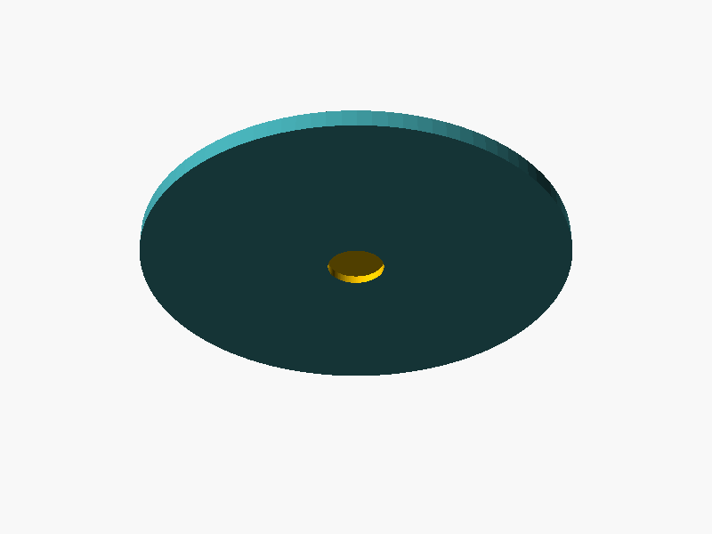 |
| `minibase-four-fifths-inch` | 1.0.0 | Four-fifths-inch round miniature base with a shallow centre recess | [minibase-four-fifths-inch/v1.0.0](https://github.com/krelinga/3d/releases/tag/minibase-four-fifths-inch%2Fv1.0.0) | 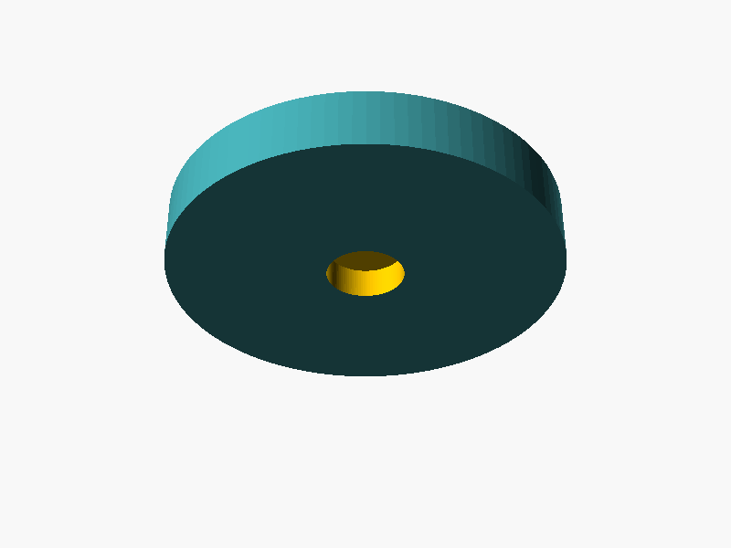 |
| `minibase-one-inch` | 1.0.0 | One-inch round miniature base with a shallow centre recess | [minibase-one-inch/v1.0.0](https://github.com/krelinga/3d/releases/tag/minibase-one-inch%2Fv1.0.0) |  |
| `minibase-one-inch-heavy` | 1.0.0 | One-inch round miniature base with a wide recess for a weight or magnet | [minibase-one-inch-heavy/v1.0.0](https://github.com/krelinga/3d/releases/tag/minibase-one-inch-heavy%2Fv1.0.0) | 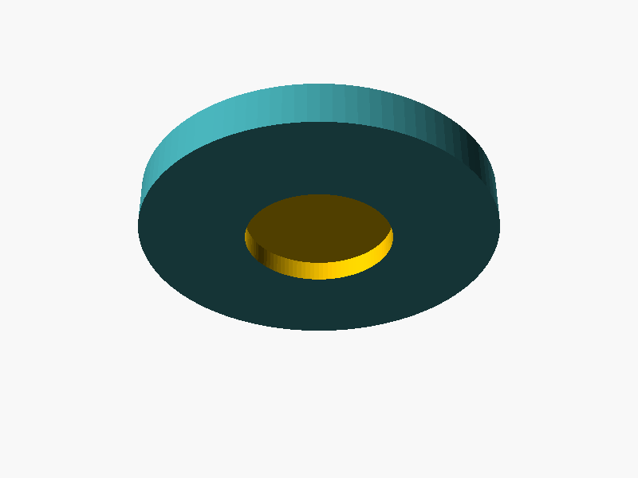 |
| `minibase-two-inch-heavy` | 1.0.0 | Two-inch round miniature base with a wide recess for a weight or magnet | [minibase-two-inch-heavy/v1.0.0](https://github.com/krelinga/3d/releases/tag/minibase-two-inch-heavy%2Fv1.0.0) | 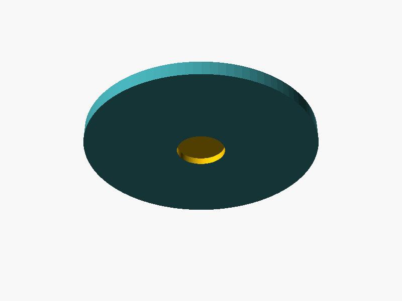 |

### fred/drawer

| Part | Version | Description | Release | Thumbnail |
|---|---|---|---|---|
| `fred-drawer-bin-back` | 1.0.0 | Storage bin for the back-right of Fred's drawer organizer, one 5x6 inch box, socketed to the pen tray beside it and the bin in front - the only part with no tabs | [fred-drawer-bin-back/v1.0.0](https://github.com/krelinga/3d/releases/tag/fred-drawer-bin-back%2Fv1.0.0) | 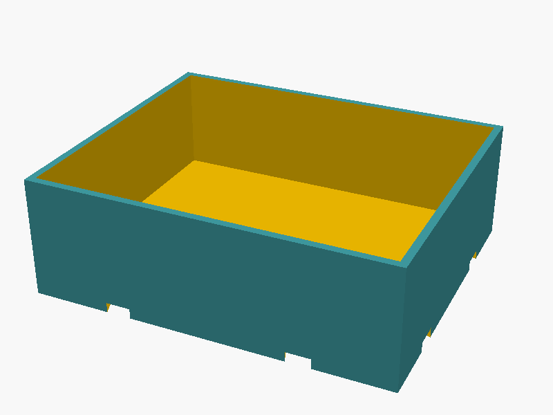 |
| `fred-drawer-bin-front` | 1.0.0 | Storage bin for the front-right of Fred's drawer organizer, one 5x6 inch box, socketed to the pen tray beside it and dovetailed to the bin behind | [fred-drawer-bin-front/v1.0.0](https://github.com/krelinga/3d/releases/tag/fred-drawer-bin-front%2Fv1.0.0) |  |
| `fred-drawer-bin-middle` | 1.0.0 | Storage bin for the middle-right of Fred's drawer organizer, one 5x6 inch box, socketed to the pen tray beside it and the bin in front, dovetailed to the bin behind | [fred-drawer-bin-middle/v1.0.0](https://github.com/krelinga/3d/releases/tag/fred-drawer-bin-middle%2Fv1.0.0) | 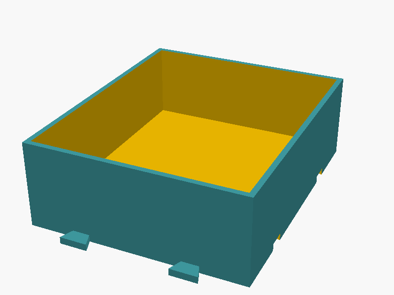 |
| `fred-drawer-dovetail-coupon` | 1.0.0 | Dovetail fit coupon for the drawer organizer - one tab and five sockets stepped either side of nominal, to find the clearance your printer actually produces | [fred-drawer-dovetail-coupon/v1.0.0](https://github.com/krelinga/3d/releases/tag/fred-drawer-dovetail-coupon%2Fv1.0.0) | 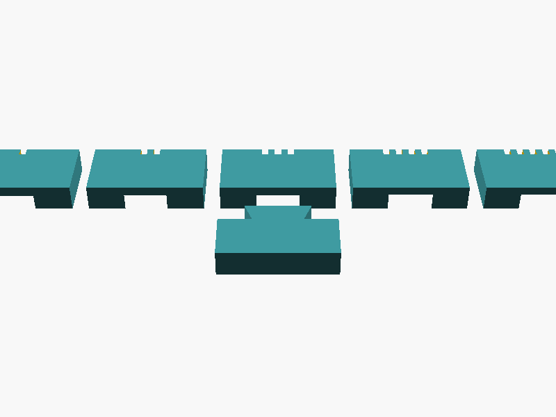 |
| `fred-drawer-pens-back` | 1.0.0 | Pen tray for the back-left of Fred's drawer organizer, four 1.5-inch cells, socketed to the tray in front and dovetailed to the bin beside it | [fred-drawer-pens-back/v1.0.0](https://github.com/krelinga/3d/releases/tag/fred-drawer-pens-back%2Fv1.0.0) | 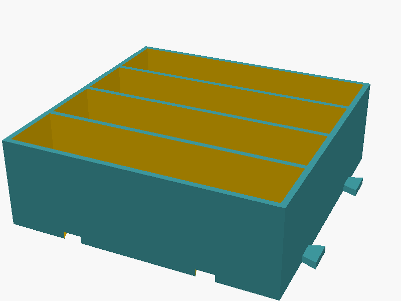 |
| `fred-drawer-pens-front` | 1.0.0 | Pen tray for the front-left of Fred's drawer organizer, four 1.5-inch cells, dovetailed to the tray behind it and the bin beside it | [fred-drawer-pens-front/v1.0.0](https://github.com/krelinga/3d/releases/tag/fred-drawer-pens-front%2Fv1.0.0) | 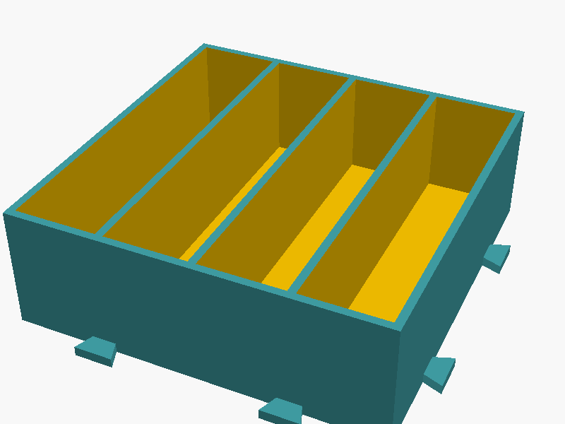 |
| `fred-drawer-pens-middle` | 1.0.0 | Pen tray for the middle-left of Fred's drawer organizer, four 1.5-inch cells, socketed to the tray in front and dovetailed to the tray behind and the bin beside it | [fred-drawer-pens-middle/v1.0.0](https://github.com/krelinga/3d/releases/tag/fred-drawer-pens-middle%2Fv1.0.0) |  |

### jigs

| Part | Version | Description | Release | Thumbnail |
|---|---|---|---|---|
| `jig-drawer-pull-96mm` | 1.1.0 | Drilling jig for a 96 mm centre-to-centre drawer pull, registering off the drawer top edge with a centre sight slot | [jig-drawer-pull-96mm/v1.1.0](https://github.com/krelinga/3d/releases/tag/jig-drawer-pull-96mm%2Fv1.1.0) | 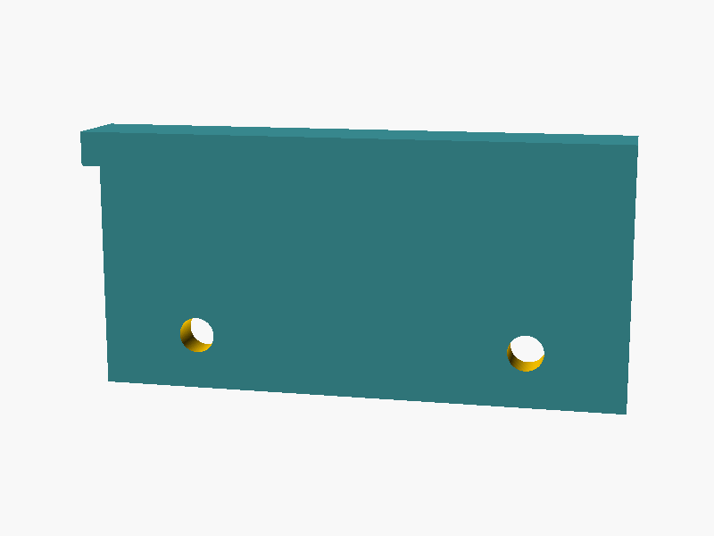 |
| `jig-drawer-pull-96mm-coupon` | 1.1.0 | Press-fit test coupon for jig-drawer-pull-96mm - five bores stepped either side of nominal, to find the diameter your printer actually produces | [jig-drawer-pull-96mm-coupon/v1.1.0](https://github.com/krelinga/3d/releases/tag/jig-drawer-pull-96mm-coupon%2Fv1.1.0) | 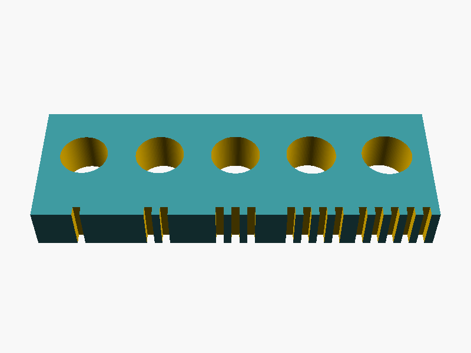 |
<!-- END INDEX -->
